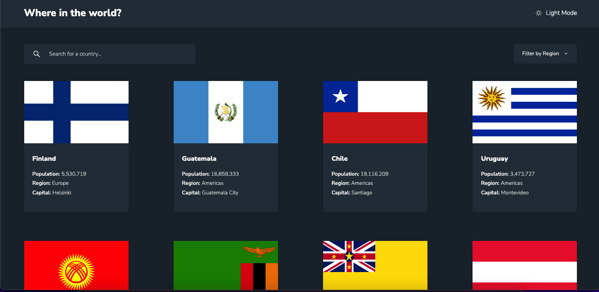

# Frontend Mentor - REST Countries API with color theme switcher solution

This is a solution to the [REST Countries API with color theme switcher challenge on Frontend Mentor](https://www.frontendmentor.io/challenges/rest-countries-api-with-color-theme-switcher-5cacc469fec04111f7b848ca). Frontend Mentor challenges help you improve your coding skills by building realistic projects.

### Screenshot

- Live Site URL: https://obinna-restcountries.netlify.app

## My process

### Built with

- Flexbox
- React
- React Router

## Author

- Frontend Mentor - [@acha-jr](https://www.frontendmentor.io/profile/acha-jr)
- Twitter - [@leoajr](https://twitter.com/leoajr)
